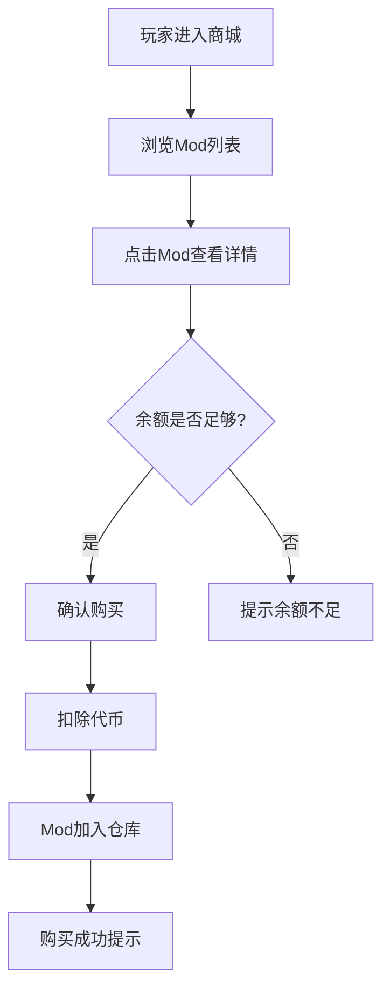
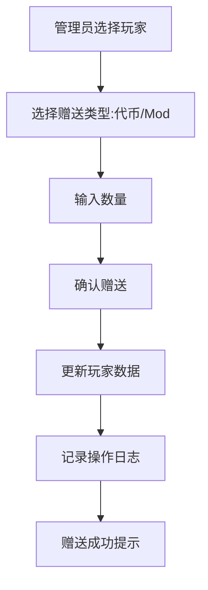
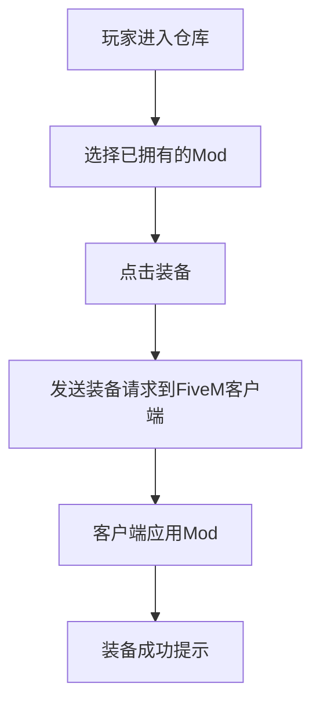

# FiveM 人物Mod插件系统 - 产品需求文档

## 1. 产品概述
FiveM服务器人物Mod插件系统，为游戏服务器提供完整的人物Mod购买、管理和分发功能。管理员可通过Web面板管理Mod商品、赠送代币和Mod给玩家，玩家可通过用户端浏览、购买和装备人物Mod。

## 2. 核心功能

### 2.1 用户角色
| 角色 | 认证方式 | 核心权限 |
|------|---------|---------|
| 管理员 | API密钥认证 | 管理系统所有资源、赠送代币/Mod、管理商品 |
| 玩家 | FiveM玩家ID | 浏览、购买、装备人物Mod、查看余额 |

### 2.2 功能模块
1. **管理员面板**
   - 用户管理：查看玩家列表、赠送代币、赠送Mod
   - 商品管理：添加/编辑/删除人物Mod、设置价格
   - 数据统计：销售统计、玩家活跃度

2. **用户端**
   - Mod商城：浏览人物Mod列表、查看详情
   - 我的仓库：查看已拥有的Mod
   - 装备管理：选择当前使用的人物Mod
   - 账户余额：查看代币余额

### 2.3 页面详情
| 页面名称 | 模块名称 | 功能描述 |
|---------|---------|---------|
| 管理面板首页 | 数据概览 | 展示关键指标：玩家总数、代币总量、今日销售 |
| 用户管理 | 玩家列表 | 显示所有玩家、余额、代币数、拥有的Mod数量 |
| 赠送功能 | 赠送表单 | 管理员选择玩家，输入代币或Mod数量进行赠送 |
| 商品管理 | Mod列表 | 展示所有Mod商品，支持增删改操作 |
| 添加商品 | Mod表单 | 上传Mod信息：名称、描述、价格、预览图、模型路径 |
| 用户商城 | Mod卡片列表 | 展示可购买的Mod，支持筛选和搜索 |
| 我的仓库 | Mod卡片列表 | 展示已拥有的Mod，点击装备 |
| 个人中心 | 账户信息 | 展示余额、历史购买记录 |

## 3. 核心流程

### 3.1 用户购买流程

### 3.2 管理员赠送流程

### 3.3 Mod装备流程

## 4. 用户界面设计

### 4.1 设计风格
- **主题**: 赛博朋克/科技感暗黑风格，契合FiveM游戏氛围
- **主色调**: 深紫 (#6C2BD9) 作为主色，霓虹粉 (#FF00FF) 作为强调色
- **背景色**: 深灰黑 (#0D0D0D) 到深紫灰 (#1A1A2E) 渐变
- **按钮风格**: 霓虹边框效果，圆角8px，hover时发光
- **字体**: 科技感强的字体，如 Orbitron (标题) + Rajdhani (正文)
- **布局**: 卡片式布局，左侧导航栏，右侧内容区
- **图标**: 使用线性风格图标，带微光效果

### 4.2 页面设计概览

#### 管理员面板
| 页面 | 模块 | UI元素 |
|------|------|--------|
| 首页 | 统计卡片 | 4个大数字卡片，显示关键数据，hover时微微上浮 |
| 用户管理 | 玩家表格 | 表格展示玩家信息，右侧操作按钮 |
| 赠送功能 | 赠送表单 | 霓虹边框输入框，下拉选择玩家 |
| 商品管理 | Mod表格 | 卡片式展示Mod，支持拖拽排序 |

#### 用户端
| 页面 | 模块 | UI元素 |
|------|------|--------|
| 商城 | Mod卡片网格 | 2-3列网格，每张卡片有悬停动画 |
| 仓库 | Mod卡片列表 | 已拥有Mod列表，装备按钮高亮 |
| 个人中心 | 信息面板 | 余额显示、购买历史时间线 |

### 4.3 响应式设计
- 桌面优先设计 (1280px+)
- 平板适配 (768px-1279px)：侧边栏收起为图标
- 移动端适配 (320px-767px)：底部Tab导航

### 4.4 交互动效
- 页面切换：淡入淡出 + 轻微上移 (300ms ease-out)
- 按钮hover：边框发光 + 背景微亮
- 卡片hover：阴影加深 + 微微上浮 (transform: translateY(-4px))
- 加载状态：霓虹脉冲动画
