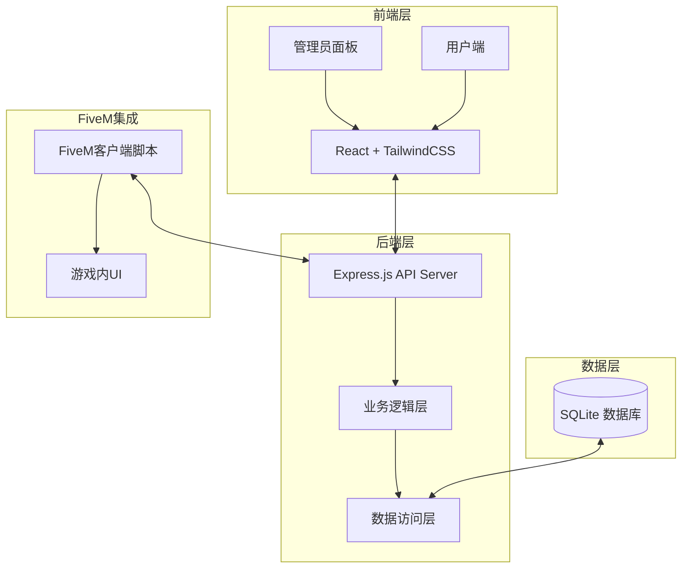
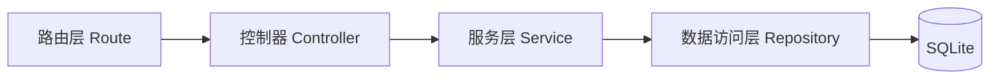
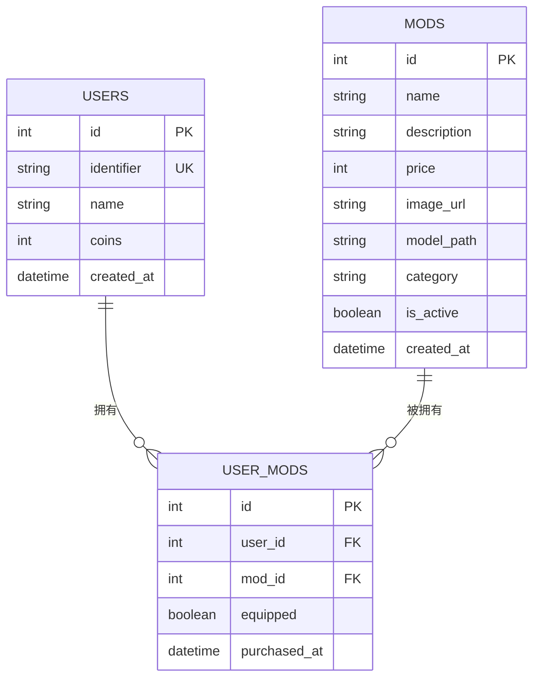

# FiveM 人物Mod插件系统 - 技术架构文档

## 1. 架构设计



## 2. 技术栈

### 前端
- **框架**: React@18 + TypeScript
- **构建工具**: Vite
- **样式**: TailwindCSS@3 + 自定义CSS变量
- **状态管理**: React Context
- **HTTP客户端**: Axios

### 后端
- **运行环境**: Node.js@18+
- **框架**: Express@4
- **数据库**: SQLite (better-sqlite3)
- **认证**: API Key

### FiveM
- **脚本语言**: Lua
- **UI**: NUI (HTML/CSS/JS)
- **通信**: SendNUIMessage / AddEventHandler

## 3. 路由定义

### 后端API路由
| 路由 | 方法 | 用途 |
|------|------|------|
| `/api/admin/stats` | GET | 获取统计数据 |
| `/api/admin/users` | GET | 获取玩家列表 |
| `/api/admin/users/:id` | GET | 获取单个玩家详情 |
| `/api/admin/users/:id/give-coins` | POST | 赠送代币 |
| `/api/admin/users/:id/give-mod` | POST | 赠送Mod |
| `/api/admin/mods` | GET | 获取Mod列表 |
| `/api/admin/mods` | POST | 创建Mod |
| `/api/admin/mods/:id` | PUT | 更新Mod |
| `/api/admin/mods/:id` | DELETE | 删除Mod |
| `/api/user/:identifier/mods` | GET | 获取玩家拥有的Mod |
| `/api/user/:identifier/coins` | GET | 获取玩家代币 |
| `/api/user/:identifier/buy-mod` | POST | 购买Mod |
| `/api/mods` | GET | 公开Mod列表 |

### FiveM NUI路由
| 路由 | 用途 |
|------|------|
| `openShop` | 打开商店UI |
| `closeShop` | 关闭商店UI |
| `purchaseSuccess` | 购买成功回调 |
| `purchaseFailed` | 购买失败回调 |
| `equipMod` | 装备Mod |
| `unequipMod` | 卸下Mod |

## 4. API定义

### 请求/响应类型

```typescript
// 玩家信息
interface User {
  id: number;
  identifier: string;  // FiveM identifier (license:xXxXxXxXxXxXxXxXxXxXxXxXxXxXxXx)
  name: string;
  coins: number;
  created_at: string;
}

// Mod信息
interface Mod {
  id: number;
  name: string;
  description: string;
  price: number;
  image_url: string;
  model_path: string;  // ped model path
  category: string;
  is_active: boolean;
  created_at: string;
}

// 玩家拥有的Mod
interface UserMod {
  id: number;
  user_id: number;
  mod_id: number;
  equipped: boolean;
  purchased_at: string;
}

// 统计数据
interface Stats {
  total_users: number;
  total_coins: number;
  total_mods: number;
  today_sales: number;
}
```

### API响应格式
```typescript
// 成功响应
{
  success: true,
  data: T
}

// 错误响应
{
  success: false,
  error: string,
  code: number
}
```

## 5. 服务器架构



### 目录结构
```
server/
├── src/
│   ├── routes/          # 路由定义
│   ├── controllers/     # 控制器
│   ├── services/       # 业务逻辑
│   ├── repositories/   # 数据访问
│   ├── models/         # 数据模型
│   ├── middleware/     # 中间件
│   └── utils/          # 工具函数
├── database.sqlite     # SQLite数据库
└── package.json
```

## 6. 数据模型

### 6.1 ER图


### 6.2 数据定义语言 (DDL)

```sql
-- 用户表
CREATE TABLE users (
    id INTEGER PRIMARY KEY AUTOINCREMENT,
    identifier VARCHAR(255) UNIQUE NOT NULL,
    name VARCHAR(100) NOT NULL,
    coins INTEGER DEFAULT 0,
    created_at DATETIME DEFAULT CURRENT_TIMESTAMP
);

-- Mod商品表
CREATE TABLE mods (
    id INTEGER PRIMARY KEY AUTOINCREMENT,
    name VARCHAR(100) NOT NULL,
    description TEXT,
    price INTEGER NOT NULL,
    image_url VARCHAR(500),
    model_path VARCHAR(255) NOT NULL,
    category VARCHAR(50) DEFAULT 'default',
    is_active BOOLEAN DEFAULT 1,
    created_at DATETIME DEFAULT CURRENT_TIMESTAMP
);

-- 玩家Mod关联表
CREATE TABLE user_mods (
    id INTEGER PRIMARY KEY AUTOINCREMENT,
    user_id INTEGER NOT NULL,
    mod_id INTEGER NOT NULL,
    equipped BOOLEAN DEFAULT 0,
    purchased_at DATETIME DEFAULT CURRENT_TIMESTAMP,
    FOREIGN KEY (user_id) REFERENCES users(id),
    FOREIGN KEY (mod_id) REFERENCES mods(id),
    UNIQUE(user_id, mod_id)
);

-- 索引
CREATE INDEX idx_users_identifier ON users(identifier);
CREATE INDEX idx_user_mods_user ON user_mods(user_id);
CREATE INDEX idx_user_mods_mod ON user_mods(mod_id);
```

## 7. FiveM集成方案

### 客户端脚本结构
```
fivem-mod/
├── fxmanifest.lua
├── client/
│   └── client.lua
├── server/
│   └── server.lua
└── ui/
    ├── index.html
    ├── app.js
    └── styles.css
```

### NUI通信协议
```lua
-- 客户端发送
SendNUIMessage({
    type = "openShop",
    data = {}
})

-- 接收后端响应
RegisterNUICallback("buyMod", function(data, cb)
    -- 处理购买逻辑
    cb({success = true})
end)
```

## 8. 配置文件

### 环境变量
```env
PORT=3000
ADMIN_API_KEY=your-secret-key
DATABASE_PATH=./database.sqlite
```

### FiveM资源清单 (fxmanifest.lua)
```lua
fx_version 'cerulean'
game 'gta5'

description 'FiveM Character Mod System'
version '1.0.0'

lua54 'yes'

server_scripts {
    'server/server.lua'
}

client_scripts {
    'client/client.lua'
}

ui_page 'ui/index.html'

files {
    'ui/index.html',
    'ui/app.js',
    'ui/styles.css'
}
```
