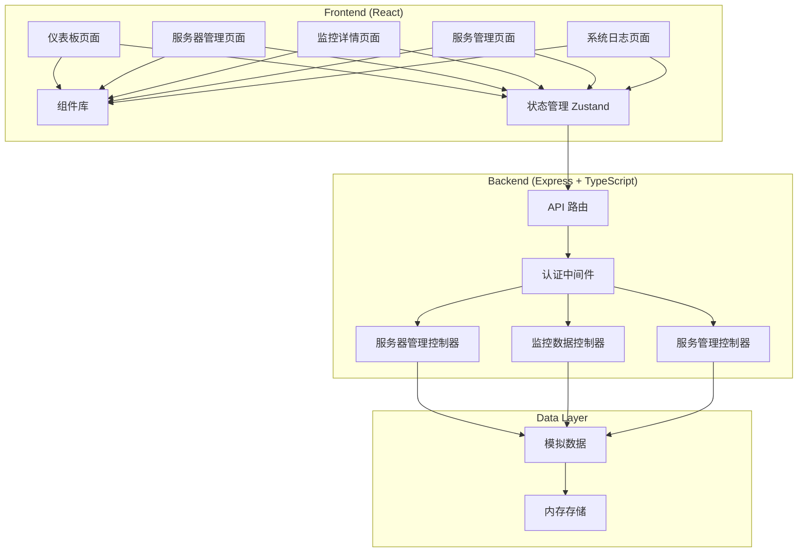
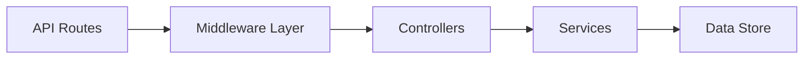
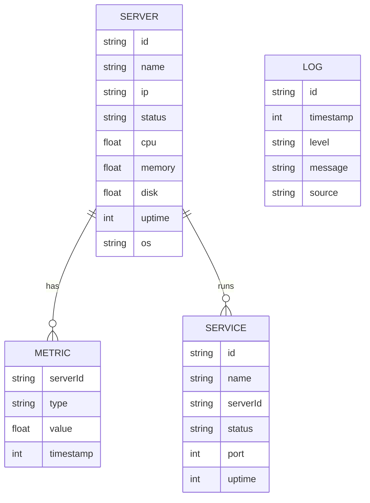

## 1. Architecture Design


## 2. Technology Description
- Frontend: React@18 + TypeScript + TailwindCSS@3 + Vite
- Backend: Express@4 + TypeScript
- State Management: Zustand
- Data Visualization: Recharts
- UI Components: Custom components with TailwindCSS
- Icons: Lucide React
- 初始化工具: vite-init (react-express-ts模板)

## 3. Route Definitions
| Route | Purpose |
|-------|---------|
| / | 仪表板页面 |
| /servers | 服务器管理页面 |
| /servers/:id | 服务器监控详情页面 |
| /services | 服务管理页面 |
| /logs | 系统日志页面 |
| /api/servers | 服务器API接口 |
| /api/metrics | 监控数据API接口 |
| /api/services | 服务管理API接口 |
| /api/logs | 系统日志API接口 |

## 4. API Definitions

### TypeScript Type Definitions
```typescript
// 服务器数据模型
interface Server {
  id: string;
  name: string;
  ip: string;
  status: 'online' | 'offline' | 'warning';
  cpu: number;
  memory: number;
  disk: number;
  uptime: number;
  os: string;
}

// 监控指标数据
interface Metric {
  timestamp: number;
  value: number;
}

interface ServerMetrics {
  serverId: string;
  cpu: Metric[];
  memory: Metric[];
  disk: Metric[];
  network: Metric[];
}

// 服务数据模型
interface Service {
  id: string;
  name: string;
  serverId: string;
  status: 'running' | 'stopped' | 'error';
  port: number;
  uptime: number;
}

// 系统日志
interface LogEntry {
  id: string;
  timestamp: number;
  level: 'info' | 'warning' | 'error';
  message: string;
  source: string;
}
```

### API Endpoints
- `GET /api/servers` - 获取服务器列表
- `POST /api/servers` - 添加服务器
- `PUT /api/servers/:id` - 更新服务器信息
- `DELETE /api/servers/:id` - 删除服务器
- `GET /api/servers/:id/metrics` - 获取服务器监控数据
- `GET /api/services` - 获取服务列表
- `POST /api/services/:id/start` - 启动服务
- `POST /api/services/:id/stop` - 停止服务
- `POST /api/services/:id/restart` - 重启服务
- `GET /api/logs` - 获取系统日志

## 5. Server Architecture Diagram


## 6. Data Model

### 6.1 Data Model Definition


### 6.2 Data Definition Language (模拟数据结构)
创建内存数据结构，包含初始模拟数据：
- 3台服务器（2台在线，1台警告）
- 每个服务器有历史监控数据
- 多个服务实例
- 系统日志条目

