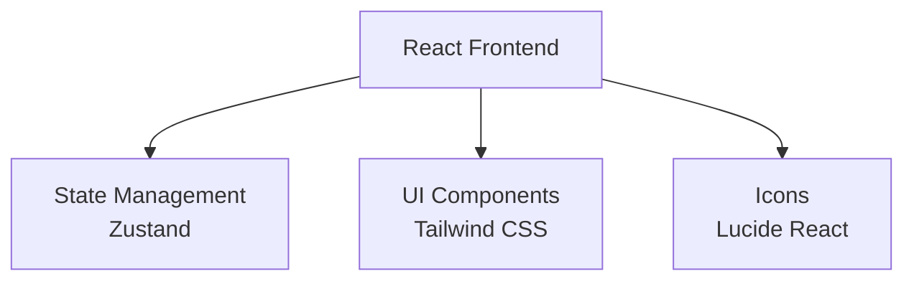

## 1. Architecture Design


## 2. Technology Description
- Frontend: React@18 + TypeScript + Vite
- Initialization Tool: vite-init
- Backend: None (纯前端应用)
- Database: None (本地状态管理)
- State Management: Zustand
- UI Framework: Tailwind CSS
- Icons: Lucide React

## 3. Route Definitions
| Route | Purpose |
|-------|---------|
| / | 空调遥控器主页面 |

## 4. API Definitions
不适用，纯前端应用

## 5. Server Architecture Diagram
不适用，纯前端应用

## 6. Data Model

### 6.1 Data Model Definition
```mermaid
graph LR
    AC[AirConditioner State] --> POWER[power: boolean]
    AC --> TEMP[temperature: number]
    AC --> MODE[mode: 'cool' | 'heat' | 'dry' | 'fan' | 'auto']
    AC --> FAN[fanSpeed: 'auto' | 'low' | 'medium' | 'high']
    AC --> SWING[swing: 'off' | 'vertical' | 'horizontal' | 'both']
    AC --> TIMER[timer: object]
```

### 6.2 TypeScript Interfaces
```typescript
interface AirConditionerState {
  power: boolean;
  temperature: number;
  mode: 'cool' | 'heat' | 'dry' | 'fan' | 'auto';
  fanSpeed: 'auto' | 'low' | 'medium' | 'high';
  swing: 'off' | 'vertical' | 'horizontal' | 'both';
  timer: {
    on: boolean;
    off: boolean;
    onTime: string;
    offTime: string;
  };
}
```
