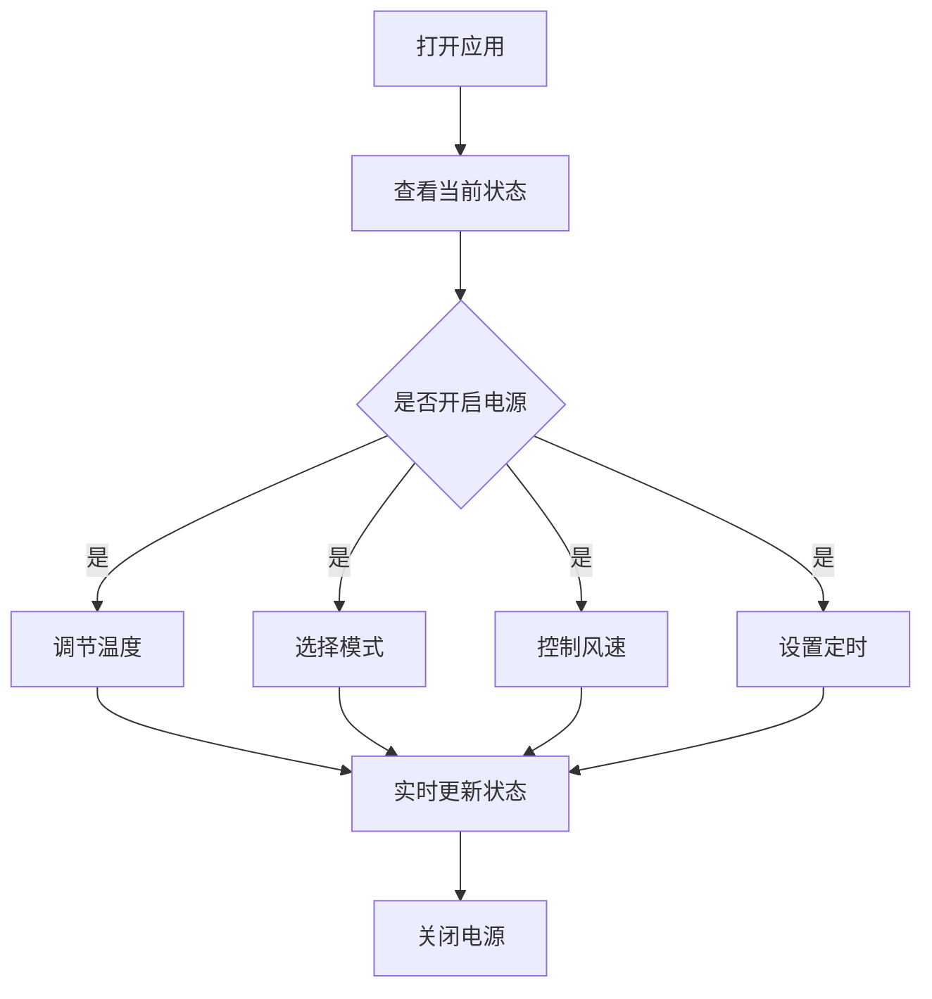

## 1. Product Overview
空调遥控器Web端应用，为用户提供一个美观、直观的虚拟空调控制界面。
- 主要功能包括温度调节、模式切换、风速控制、定时开关等
- 目标用户为希望通过浏览器便捷控制空调的家庭用户

## 2. Core Features

### 2.1 Feature Module
1. **主控制面板**: 温度显示与调节、电源开关、模式选择
2. **风速控制**: 多档风速选择、风向控制
3. **定时功能**: 定时开关设置
4. **状态显示**: 当前状态指示、温度可视化

### 2.3 Page Details
| Page Name | Module Name | Feature description |
|-----------|-------------|---------------------|
| 主控制面板 | 电源开关 | 一键开启/关闭空调，带有平滑动画效果 |
| 主控制面板 | 温度调节 | 通过加减按钮调节温度(16-30°C)，显示当前温度 |
| 主控制面板 | 模式选择 | 制冷、制热、除湿、送风、自动五种模式 |
| 风速控制 | 风速档位 | 自动、低速、中速、高速四档风速 |
| 风速控制 | 风向控制 | 上下扫风、左右扫风、固定位置 |
| 定时功能 | 定时开关 | 设置定时开机和关机时间 |

## 3. Core Process
用户打开应用，看到空调当前状态；用户可开启电源，调节温度、模式、风速，设置定时；所有操作实时反馈，状态及时更新。

## 4. User Interface Design
### 4.1 Design Style
- 主色调: 冷蓝色(#2563EB)到紫色(#7C3AED)渐变，体现科技感和清凉感
- 按钮风格: 圆角矩形，带有阴影和悬停效果
- 字体: 使用Poppins字体，优雅现代
- 布局风格: 卡片式布局，中央聚焦的控制面板
- 图标风格: 简洁的线性图标，与整体风格统一

### 4.2 Page Design Overview
| Page Name | Module Name | UI Elements |
|-----------|-------------|-------------|
| 主控制面板 | 温度显示 | 大号数字显示，周围有温度环形可视化 |
| 主控制面板 | 模式按钮 | 五个模式图标按钮，选中状态有高亮效果 |
| 风速控制 | 风速按钮 | 垂直排列的风速档位按钮 |
| 定时功能 | 时间选择器 | 美观的时间选择控件 |

### 4.3 Responsiveness
- 桌面端为主要设计目标
- 同时适配平板和移动设备，响应式布局
- 触控优化，按钮尺寸适合手指点击

### 4.4 3D Scene Guidance
不适用3D场景
