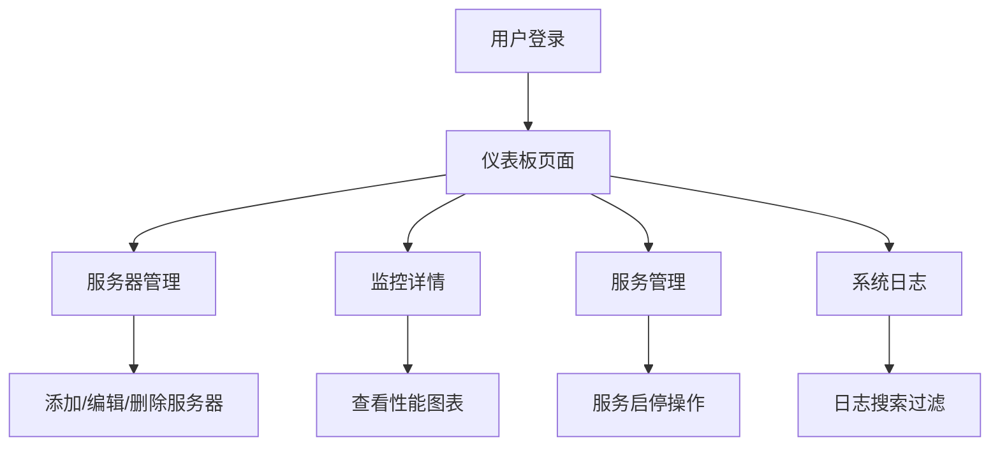

## 1. Product Overview
服务器管理系统是一个用于监控、管理多台服务器的Web应用。主要解决服务器资源监控、服务状态管理、系统日志查看等问题。目标用户为系统管理员和DevOps工程师。
- 提供直观的服务器监控仪表板
- 支持多服务器集中管理
- 实时监控服务器性能指标

## 2. Core Features

### 2.1 User Roles
| Role | Registration Method | Core Permissions |
|------|---------------------|------------------|
| Admin | Email/Password | 完整的系统访问权限 |
| Operator | Email/Password | 服务器监控和服务管理 |

### 2.2 Feature Module
1. **仪表板页面**: 服务器概览、性能统计、告警通知
2. **服务器管理**: 服务器列表、添加/编辑/删除服务器
3. **监控详情**: CPU、内存、磁盘、网络使用率图表
4. **服务管理**: 服务列表、启动/停止/重启服务
5. **系统日志**: 日志查看、搜索和过滤

### 2.3 Page Details
| Page Name | Module Name | Feature description |
|-----------|-------------|---------------------|
| 仪表板 | 服务器概览 | 显示所有服务器的状态统计和告警信息 |
| 仪表板 | 性能指标 | 展示CPU、内存、磁盘等关键指标的实时数据 |
| 服务器管理 | 服务器列表 | 表格形式展示所有服务器信息 |
| 服务器管理 | 服务器详情 | 查看单个服务器的详细信息和配置 |
| 监控详情 | 指标图表 | 使用图表展示历史和实时性能数据 |
| 服务管理 | 服务操作 | 支持启动、停止、重启服务 |
| 系统日志 | 日志查看 | 展示系统日志并支持搜索过滤 |

## 3. Core Process
用户登录系统后，首先看到仪表板页面，了解整体服务器状况。可以通过导航菜单访问不同功能模块：查看服务器列表，添加新服务器，查看监控详情，管理服务，查看系统日志。系统提供实时数据更新和告警通知功能。

## 4. User Interface Design
### 4.1 Design Style
- 主色调：深蓝色 (#1e3a8a) 和青绿色 (#0ea5e9)
- 按钮风格：现代化圆角按钮，带悬停效果
- 字体：Inter 作为基础字体，Roboto Mono 用于代码/数据展示
- 布局风格：卡片式布局，顶部导航 + 侧边栏
- 图标风格：使用 Lucide 图标库，简洁现代

### 4.2 Page Design Overview
| Page Name | Module Name | UI Elements |
|-----------|-------------|-------------|
| 仪表板 | 概览卡片 | 渐变背景、统计数字、状态指示 |
| 仪表板 | 性能图表 | 响应式图表组件、实时数据更新动画 |
| 服务器管理 | 服务器列表 | 可排序表格、状态标签、操作按钮 |
| 监控详情 | 指标图表 | 面积图、折线图、时间轴选择器 |
| 服务管理 | 服务卡片 | 网格布局、状态指示器、操作菜单 |
| 系统日志 | 日志面板 | 代码样式展示、高亮显示、搜索框 |

### 4.3 Responsiveness
采用响应式设计，优先支持桌面端，适配平板和移动端。

### 4.4 Data Visualization
- 使用 Recharts 库实现数据可视化
- 支持多种图表类型：折线图、面积图、柱状图
- 图表支持响应式缩放和交互
- 数据更新时提供平滑的过渡动画

